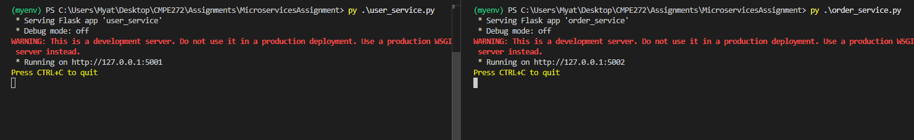
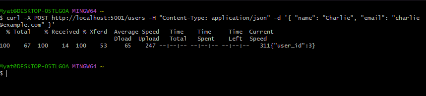
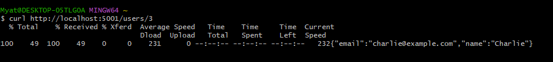
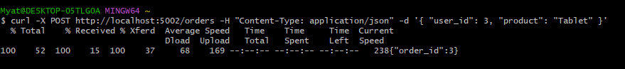
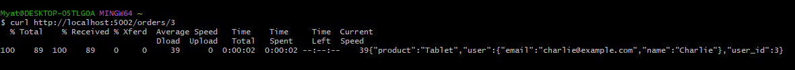

# Microservices Assignment

Use virtual python environment pyenv to install flask and other necessary libraries to run the order and user services to
simulate how they work independently similar to microservices 

## To use a virtual environment to manage dependencies for the project

### Create a virtual environment
```bash
python -m venv myenv
```
### Activate the virtual environment
#### On Windows:
```bash
myenv\Scripts\activate
```
#### On macOS/Linux:
```bash
source myenv/bin/activate
```
### Install Flask
```bash
pip install flask requests
```

## Output

### Both services are running on different ports independently



### Running the Example Requests


#### Creating a User

#### Getting a User

#### Creating an Order

#### Getting the Order
